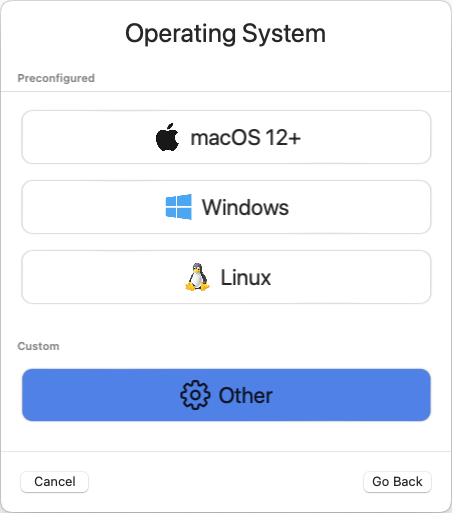
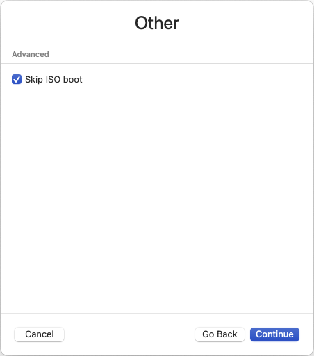
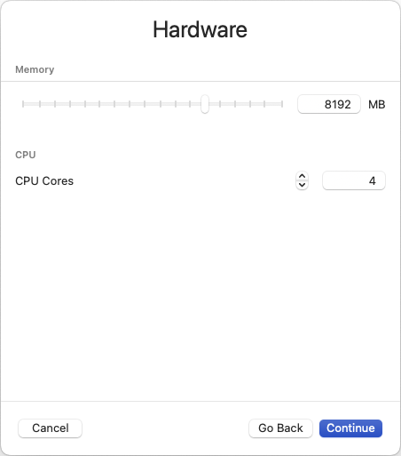
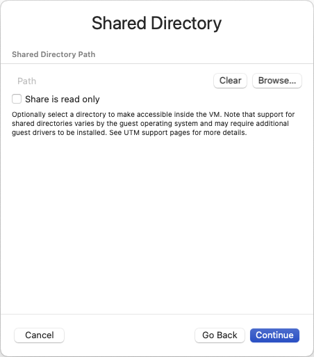
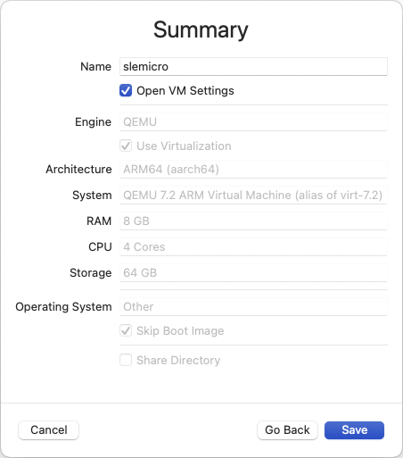
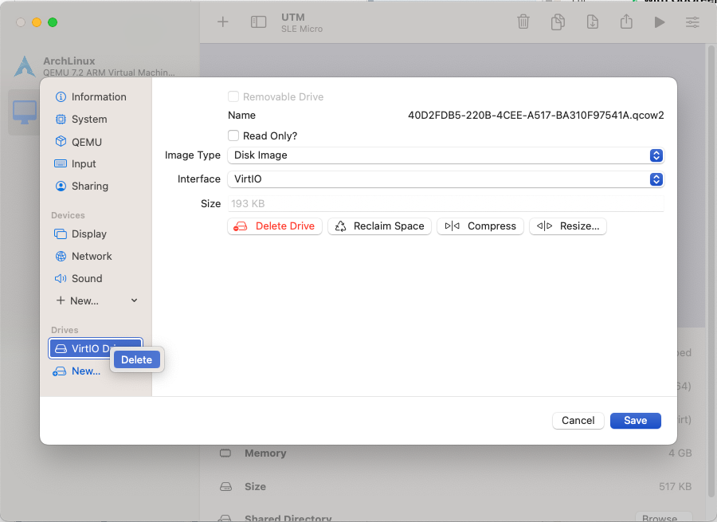
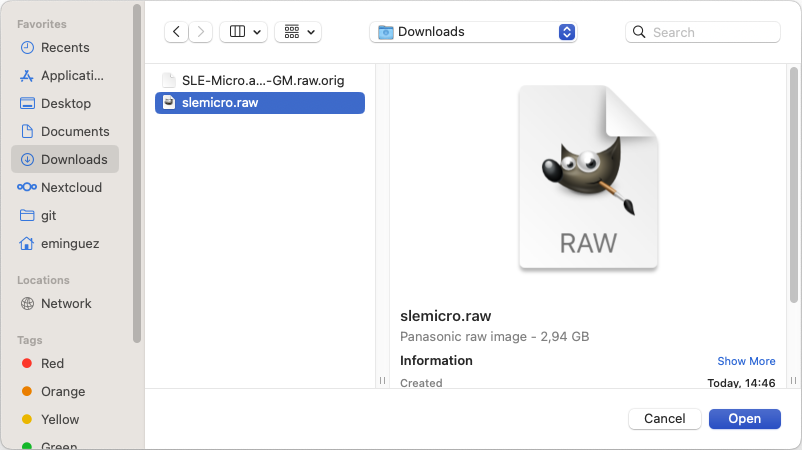
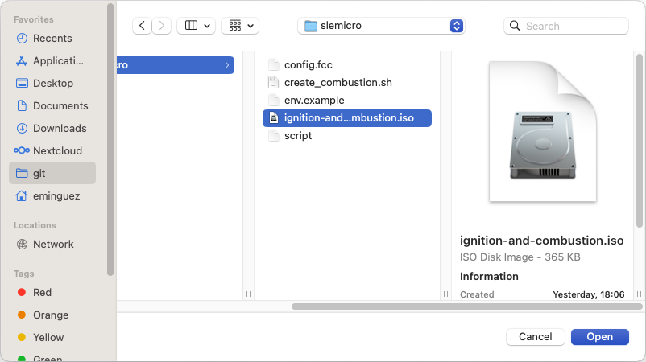
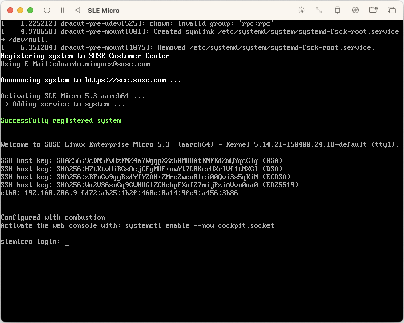

# Intro
## OSX Virtualization

Virtualization of Linux hosts on OSX can be achieved with various tools.
There are commercial products such as VMWare Fusion or Parallels Desktop
as well as open-source projects such as VirtualBox, UTM or Lima.

UTM is an OSX application that uses QEMU under the hood and offers a GUI
to manage the VM lifecycle. It supports Apple silicon CPUs, and it can
use native OSX virtualization (Virtualization.framework) as well. It
also has a scripting interface via [Apple
Script](https://docs.getutm.app/scripting/scripting/) to automate some
processes and a proper CLI (utmctl) is on the works.

Lima is based on QEMU (experimental support for
Virtualization.framework) as well and it launches Linux virtual machines
with automatic file sharing and port forwarding (like WSL2), and
containerd. Lima is expected to be used on macOS hosts, but can be used
on Linux hosts as well. Lima has a proper CLI tool (limactl) and the
best part is VMs can be defined in yaml files, so you can even deploy
K8s clusters with just a single command
(see https://github.com/lima-vm/lima/blob/master/examples/k8s.yaml)

**NOTE:** Rancher desktop is [based on Lima](https://github.com/rancher-sandbox/rancher-desktop/issues/3702)

However, Lima doesn't support SLE Micro
([yet](https://github.com/lima-vm/lima/issues/1456)) as Lima customizes
the VM at boot to install some packages and services and SLE Micro uses a
different approach to those things (for example as it is immutable, it
requires installing packages using ignition/combustion)

## SLE Micro installation automation: ISO vs Image

SLE Micro can be installed traditionally using an ISO file that boots
once and using click-ops you can customize it as you wish
(see https://documentation.suse.com/sle-micro/5.3/single-html/SLE-Micro-deployment/#cha-install)
but that won't be useful.

ISO installation can be customized using boot parameters
(see https://documentation.suse.com/sle-micro/5.3/single-html/SLE-Micro-deployment/#sec-boot-parameters-list)
but those don't cover all the options. However, ISO based installation
supports using AutoYaST (see https://documentation.suse.com/sle-micro/5.3/single-html/SLE-Micro-autoyast/)
to automate the installation process.

SLE Micro can be also deployed using pre-built images. Currently, there
are two types of images available: raw disk images and selfinstall ISOs.

SLE Micro raw images are delivered for the AMD64/Intel 64 architecture,
IBM Z ZSeries and also AArch64, however the selfinstall images are
currently delivered only for the AMD64/Intel 64 architecture. The
pre-built images (both selfinstall ISOs and raw disk images) are
intended to be configured on the first boot by using either Ignition or
Combustion.

*To summarize*, the two ways as of today to deploy SLE Micro on Aarch64
on an automated fashion would be using the ISO + AutoYaST or raw
images + Ignition/Combustion.

## Ignition vs Butane vs Combustion

**Ignition** is a provisioning tool that enables you to configure a
system according to your specification on the first boot. When the
system is booted for the first time, Ignition is loaded as part of an
initramfs and searches for a configuration file within a specific
directory (on a USB flash disk, or you can provide a URL). All changes
are performed before the kernel switches from the temporal file system
to the real root file system (before the switch_root command is issued).
Ignition uses a configuration file in the JSON format. The file is
called config.ign. SLE Micro supports
[Ignition config spec 3.3.0](https://coreos.github.io/ignition/configuration-v3_3/)
(see
https://documentation.suse.com/sle-micro/5.3/single-html/SLE-Micro-deployment/#sec-ignition-configuration
for more information).

Ignition files can be complex to generate manually (specially for the
file permissions syntax in hex or multiline things) so you can use
[opensuse.github.io/fuel-ignition](https://opensuse.github.io/fuel-ignition/)
to help you generate a basic one.

**Butane** is a more human readable (and writable) configuration syntax
based on yaml that can be translated to Ignition easily with the [butane
CLI](https://coreos.github.io/butane/) as Butane is not consumable by
Ignition.

**Combustion** is a dracut module that enables you to configure your
system on its first boot. Combustion reads a provided file called script
and executes commands in it and thus performs changes to the file
system. You can use Combustion to change the default partitions, set
users\' passwords, create files, install packages, etc.

The Combustion dracut module is invoked after the ignition.firstboot
argument is passed to the kernel command line. Combustion then reads the
configuration from script. Combustion tries to configure the network, if
the network flag has been found in script. After `/sysroot` is mounted,
Combustion tries to activate all mount points in `/etc/fstab` and then
call `transactional-update` to apply other changes (like setting root
password or installing packages).
See https://documentation.suse.com/sle-micro/5.3/single-html/SLE-Micro-deployment/#sec-combustion-script
for more information.

## Ignition/Combustion and UTM

Ignition and Combustion are intended to automate the deployment of SLE
Micro systems. To use them with UTM there are a couple of alternatives:

- Use the QEMU `fw_cfg` flag as `-fw_cfg name=opt/org.opensuse.combustion/script,file=/var/combustion-script`
  for combustion or `-fw_cfg name=opt/com.coreos/config,file=PATH_TO_config.ign` for ignition

- Create a raw disk or ISO file to host the Ignition or Combustion (or
  both) files.

For Ignition, the configuration file `config.ign` must reside in the
`ignition` subdirectory on the configuration media labeled `ignition`. The
directory structure must look as follows:

```
<root directory>
└── ignition
    └── config.ign
```

For Combustion, the configuration device needs to be named `combustion`, a
specific directory structure in that configuration medium needs to be
created and include a configuration file named `script`. In the root
directory of the configuration medium, create a directory called
`combustion` and place the `script` into this directory along with other
files---SSH key, configuration files, etc. The directory structure then
should look as follows:

```
<root directory>
└── combustion
    └── script
    └── other files
```

Combustion can be used along with Ignition. If you intend to do so,
label your configuration medium `ignition` and include the `ignition`
directory with the `config.ign` to your directory structure as shown
below:

```
<root directory>
└── combustion
    └── script
    └── other files
└── ignition
    └── config.ign
```

In this scenario, Ignition runs before Combustion.

# Image-based process step by step

**NOTE**: There is a helper script that automates all the steps included here
<https://github.com/suse-edge/misc/blob/main/slemicro/create_vm.sh>
  
## Prerequisites

- SLE Micro raw image
  - Download the raw image file from the SUSE website at https://www.suse.com/download/sle-micro/
    - Select ARM architecture
    - Look for the raw file (I.e.- `SLE-Micro.aarch64-5.3.0-Default-GM.raw.xz`)

  **NOTE:** You need to have a valid user on the SUSE site to be able to
  download the file.

- Access to <https://scc.suse.com/> to generate a registration code
- Butane, qemu and cdrtools installed (using brew for example)
  ```
  brew install butane cdrtools qemu
  ```

- UTM installed (using brew for example)

  ```
  brew install --cask utm
  ```

**Note:** If using the previous script, it is required to install UTM
4.2.2 at least as it includes the proper support for the automation.

## Image preparation

- Uncompress the SLE Micro image

  ```
  xz -d ~/Downloads/SLE-Micro.aarch64-5.3.0-Default-GM.raw.xz
  ```

- Move the file to a proper location and rename it to fit the VM
  hostname

  ```
  cp ~/Downloads/SLE-Micro.aarch64-5.3.0-Default-GM.raw
  ~/VMs/slemicro.raw
  ```

- Resize the image file. In this example, to 30G

  ```
  qemu-img resize -f raw ~/VMs/slemicro.raw 30G > /dev/null
  ```

## Ignition & Combustion files

To automate the installation, we will leverage Butane, Ignition and
Combustion as explained before:

- Create a temporary folder to store the assets

  ```
  TMPDIR=$(mktemp -d)
  ```
- Create the required folders for ignition and combustion

  ```
  mkdir -p ${TMPDIR}/{combustion,ignition}
  ```

- Create a `config.fcc` butane config file as required. See the
  following example to set a `root` password for the root user, and to
  configure the hostname to be "slemicro"'

  ```
  cat << EOF > ${TMPDIR}/config.fcc 
  variant: fcos 
  version: 1.4.0 
  storage: 
    files: 
      - path: /etc/hostname 
        mode: 0644 
        overwrite: true 
        contents: 
          inline: "slemicro" 
  passwd: 
    users: 
     - name: root 
       password_hash: "$y$j9T$/t4THH10B7esLiIVBROsE.$G1lyxfy/MoFVOrfXSnWAUq70Tf3mjfZBIe18koGOuXB" 
  EOF 
  ```

- Create a script combustion file as required. See the following
  example to register the SLE Micro instance to SUSE's SCC (use your
  own email/regcode) and to create a `/etc/issue.d/combustion` file

  ```
  cat << EOF > ${TMPDIR}/combustion/script  
  #!/bin/bash 
  # combustion: network 

  # Redirect output to the console 
  exec > >(exec tee -a /dev/tty0) 2>&1

  # Set hostname at combustion phase for SUSEConnect
  hostname slemicro

  # Registration 
  if ! which SUSEConnect > /dev/null 2>&1; then 
      zypper --non-interactive install suseconnect-ng 
  fi 

  SUSEConnect --email foobar@suse.com --url https://scc.suse.com --regcode YOURCODE 

  # Leave a marker 
  echo "Configured with combustion" > /etc/issue.d/combustion 
  EOF 
  ```

- Convert the butane config to ignition

  ```
  butane -p -o ${TMPDIR}/ignition/config.ign ${TMPDIR}/config.fcc
  ```

- Create an ISO file. It is requried for both ignition and combustion
  to work that the ISO is labeled as `ignition` (hence the -V
  parameter)

  ```
  mkisofs -full-iso9660-filenames -o ignition-and-combustion.iso -V ignition ${TMPDIR}
  ```

- **Optional:** Remove the temporary folder

  ```
  rm -Rf ${TMPDIR}
  ```

## VM Creation

Now it is time to finally use UTM to boot the VM


Create a New Virtual Machine using Virtualization


Select "Other"



Enable the "Skip ISO boot" option as we will use the raw disk directly



Select the required CPU/RAM:



Accept the storage size as it is, it will be deleted before booting it


Skip the Shared Directory



Edit the VM name and enable the "Open VM Settings" toggle to customize
it further:



Delete the VirtIO Drive



Add a new Device and select "Import"


Select the raw image file (\~/VMs/slemicro.raw in this case)



Repeat the last two steps to add the ignition-and-combustion.iso file



Configure the ISO as Read Only and "CD/DVD (ISO) Image"


Finally, boot the VM.

After a couple of seconds, the VM will boot up and will configure itself
using the ignition and combustion scripts, including registering itself
to SCC




**NOTE:** In case the VM doesn't get network connectivity, try
https://github.com/utmapp/UTM/discussions/3530#discussioncomment-5072113

# ISO Process (TBD)
- Download the ISO file
- Create a new VM on UTM using the ISO file
- Create the autoyast answer file
- Use the AutoYaST boot parameter to map to the answer file
- Boot the VM
- Profit!
